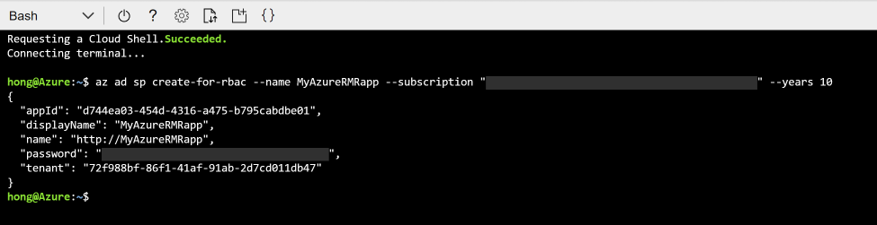

# AzureRMR

AzureRMR is a package for interacting with Azure Resource Manager: authenticate, list subscriptions, manage resource groups, deploy and delete templates and resources. It calls the Resource Manager [REST API](https://docs.microsoft.com/en-us/rest/api/resources) directly, so you don't need to have PowerShell or Python installed.

AzureRMR is not yet available on CRAN. You can install it from GitHub, via `devtools::install_github("cloudyr/AzureRMR")`.

## Activating

To use AzureRMR, you must create and register a service principal with Azure Active Directory. This is a one-time task, and the easiest method is to use the Azure cloud shell.

- In the Azure Portal (https://portal.azure.com), click on the Cloud Shell icon:


- If you haven't used the shell before, there will be a dialog box to choose whether to use bash or PowerShell. Choose bash.
- In the shell, type `az ad sp create-for-rbac --name {app-name} --subscription "{your-subscription-name}" --years {N}`, substituting the desired name of your service principal (try to make it memorable to you, and unlikely to clash with other names), your subscription name, and the number of years you want the password to be valid.
- Wait until the app creation is complete. You should see a screen like this.



- Record your tenant ID, app ID, and password.

## Details

AzureRMR is meant to provide only the base functionality for working with Resource Manager. You can extend it to support specific Azure services like [virtual machines](https://github.com/cloudyr/AzureVM) or [storage accounts](https://github.com/cloudyr/AzureStor). For more information, see the ["Extending AzureRMR" vignette](vignettes/extend.Rmd).

Here is a sample workflow. The package uses R6 classes to represent all Azure objects, including authentication tokens (extending the functionality provided by the httr package), subscriptions, resource groups, and individual resources. OAuth 2.0 authentication is supported using both client credentials and device code flow. Tokens will be automatically refreshed/renewed if they expire during a session.

```r
# create the client app
az <- az_rm$new(tenant="xxx-xxx-xxx",
                app="yyy-yyy-yyy",
                password="{your-password}")

# authenticating with device code: R will display a code to enter in your browser
az2 <- az_rm$new(tenant="xxx-xxx-xxx",
                 app="zzz-zzz-zzz",
                 auth_type="device")

# authenticating with credentials stored in a JSON file
az3 <- az_rm$new(config_file="creds.json")
```

Working with subscriptions and resource groups:

```r
# all subscriptions associated with this app
az$list_subscriptions()
#$`5710aa44-281f-49fe-bfa6-69e66bb55b11`
#<Azure subscription 5710aa44-281f-49fe-bfa6-69e66bb55b11>
#  authorization_source: Legacy
#  name: Visual Studio Ultimate with MSDN
#  policies: list(locationPlacementId, quotaId, spendingLimit)
#  state: Enabled
#---
#  Methods:
#    create_resource_group, delete_resource_group, get_provider_api_version, get_resource_group,
#    list_locations, list_resource_groups, list_resources
#
#$`e26f4a80-370f-4a77-88df-5a8d291cd2f9`
#<Azure subscription e26f4a80-370f-4a77-88df-5a8d291cd2f9>
#  authorization_source: RoleBased
#  name: ADLTrainingMS
#  policies: list(locationPlacementId, quotaId, spendingLimit)
#  state: Enabled
#---
#  Methods:
#    create_resource_group, delete_resource_group, get_provider_api_version, get_resource_group,
#    list_locations, list_resource_groups, list_resources
#
#...

# get a subscription and resource group
sub1 <- az$get_subscription("5710aa44-281f-49fe-bfa6-69e66bb55b11")
rg <- sub1$get_resource_group("rdev1")
rg
#<Azure resource group rdev1>
#  id: /subscriptions/5710aa44-281f-49fe-bfa6-69e66bb55b11/resourceGroups/rdev1
#  location: australiaeast
#  managed_by: NULL
#  properties: list(provisioningState)
#  tags: NULL
#---
#  Methods:
#    check, create_resource, delete, delete_resource, delete_template, deploy_template, get_resource,
#    get_template, list_resources, list_templates

# create and delete a resource group
test <- sub1$create_resource_group("test_group")
test$delete(confirm=FALSE)
```

Working with resources:

```r
# a list of resources
names(rg$list_resources())
#[1] "Microsoft.Compute/virtualMachines/rdevtest2"            "Microsoft.Network/networkInterfaces/rdevtest2"         
#[3] "Microsoft.Network/publicIPAddresses/rdevtest2"          "Microsoft.Network/virtualNetworks/rdevtest2"           
#[5] "Microsoft.Storage/storageAccounts/5ywqbejwetquylindsvm" "Microsoft.Storage/storageAccounts/rdevstor1"

rg$get_resource(type="Microsoft.Storage/storageServices", name="rdevstor1")
#<Azure resource Microsoft.Storage/storageAccounts/rdevstor1>
#  id: /subscriptions/5710aa44-281f-49fe-bfa6-69e66bb55b11/resourceGroups/rdev1/providers/Microsoft.Sto ...
#  identity: NULL
#  is_synced: TRUE
#  kind: Storage
#  location: australiasoutheast
#  managed_by: NULL
#  plan: NULL
#  properties: list(networkAcls, trustedDirectories, supportsHttpsTrafficOnly, encryption,
#    provisioningState, creationTime, primaryEndpoints, primaryLocation, statusOfPrimary)
#  sku: list(name, tier)
#  tags: list()
#---
#  Methods:
#    check, delete, do_operation, set_api_version, sync_fields, update

# method chaining also works
az $
    get_subscription("5710aa44-281f-49fe-bfa6-69e66bb55b11") $
    get_resource_group("rdev1") $
    get_resource(type="Microsoft.Storage/storageServices", name="rdevstor1")
#<Azure resource Microsoft.Storage/storageAccounts/rdevstor1>
# ...
```

Create a new resource group and deploy a template ([Product Recommendations](https://github.com/Microsoft/Product-Recommendations) webapp):

```r
tg <- sub1$create_resource_group("testrg", location="australiasoutheast")

template_uri <- "https://raw.githubusercontent.com/Microsoft/Product-Recommendations/master/saw/recommendationswebapp/core/arm/resources.json"
package_uri <- "https://github.com/Microsoft/Product-Recommendations/raw/master/saw/recommendationswebapp/assets/Recommendations.WebApp.zip"

tg$deploy_template("sartest3", template=template_uri, parameters=list(deployPackageUri=package_uri))
#<Azure template sartest3>
#  id: /subscriptions/5710aa44-281f-49fe-bfa6-69e66bb55b11/resourceGroups/testrg/providers/Microsoft.Resour ...
#  properties: list(templateLink, templateHash, parameters, mode, debugSetting, provisioningState,
#    timestamp, duration, correlationId, providers, dependencies)
#---
#  Methods:
#    cancel, check, delete
```

---
[](https://github.com/cloudyr)
