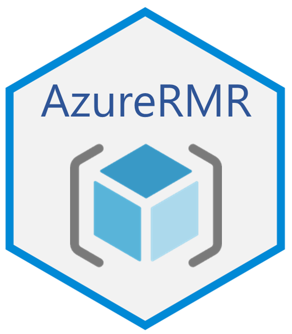

# AzureRMR 

[](https://cran.r-project.org/package=AzureRMR)


AzureRMR is a package for interacting with Azure Resource Manager: list subscriptions, manage resource groups, deploy and delete templates and resources. It calls the Resource Manager [REST API](https://learn.microsoft.com/en-us/rest/api/resources) directly, so you don't need to have PowerShell or Python installed. Azure Active Directory OAuth tokens are obtained using the [AzureAuth](https://github.com/Azure/AzureAuth) package.

The primary repo for this package is at https://github.com/Azure/AzureRMR; please submit issues and PRs there. It is also mirrored at the Cloudyr org at https://github.com/cloudyr/AzureRMR. You can install the development version of the package with `devtools::install_github("Azure/AzureRMR")`.

## Authentication

Under the hood, AzureRMR uses a similar authentication process to the [Azure CLI](https://learn.microsoft.com/en-us/cli/azure/?view=azure-cli-latest). The first time you authenticate with a given Azure Active Directory tenant, you call `create_azure_login()` and supply your credentials. AzureRMR will prompt you for permission to create a special data directory in which to cache the obtained authentication token and Resource Manager login. Once this information is saved on your machine, it can be retrieved in subsequent R sessions with `get_azure_login()`. Your credentials will be automatically refreshed so you don't have to reauthenticate.

Unless you have a specific reason otherwise, it's recommended that you allow AzureRMR to create this caching directory. Note that many other cloud engineering tools save credentials in this way, including the Azure CLI itself.

See the "Authentication basics" vignette for more details on how to authenticate with AzureRMR.


## Sample workflow

```r
library(AzureRMR)

# authenticate with Azure AD:
# - on first login to this client, call create_azure_login()
# - on subsequent logins, call get_azure_login()
az <- create_azure_login()

# get a subscription and resource group
sub <- az$get_subscription("{subscription_id}")
rg <- sub$get_resource_group("rgname")

# get a resource (storage account)
stor <- rg$get_resource(type="Microsoft.Storage/storageAccounts", name="mystorage")

# method chaining works too
stor <- az$
    get_subscription("{subscription_id}")$
    get_resource_group("rgname")$
    get_resource(type="Microsoft.Storage/storageAccounts", name="mystorage")


# create a new resource group and resource
rg2 <- sub$create_resource_group("newrgname", location="westus")

stor2 <- rg2$create_resource(type="Microsoft.Storage/storageAccounts", name="mystorage2",
    kind="Storage", sku=list(name="Standard_LRS"))

# tagging
stor2$set_tags(comment="hello world!", created_by="AzureRMR")

# role-based access control (RBAC)
# this uses the AzureGraph package to retrieve the user ID
gr <- AzureGraph::get_graph_login()
usr <- gr$get_user("username@aadtenant.com")
stor2$add_role_assignment(usr, "Storage blob data contributor")

# pass the GUID of the principal if you don't have AzureGraph installed
stor2$add_role_assignment("041ff2be-4eb0-11e9-8f38-394fbcd0b29d", "Storage blob data contributor")
```

## Extending

AzureRMR is meant to be a generic mechanism for working with Resource Manager. You can extend it to provide support for service-specific features; examples of packages that do this include [AzureVM](https://github.com/Azure/AzureVM) for [virtual machines](https://azure.microsoft.com/en-us/services/virtual-machines/), and [AzureStor](https://github.com/Azure/AzureStor) for [storage accounts](https://azure.microsoft.com/en-us/product-categories/storage/). For more information, see the ["Extending AzureRMR" vignette](vignettes/extend.Rmd).

## Acknowledgements

AzureRMR is inspired by the package AzureSMR, originally written by Alan Weaver and Andrie de Vries, and would not have been possible without their pioneering work. Thanks, guys!

---
<p align="center"><a href="https://github.com/Azure/AzureR"></a></p>
