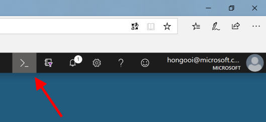

AzureRMR is a package for interacting with Azure Resource Manager: authenticate, list subscriptions, manage resource groups, deploy and delete templates and resources. It calls the Resource Manager [REST API](https://docs.microsoft.com/en-us/rest/api/resources) directly, so you don't need to have PowerShell or Python installed.

As a general-purpose interface to Azure Resource Manager (ARM), you can use AzureRMR to work with nearly any Azure object that ARM can handle: subscriptions, resource groups, resources, templates and so on. The things you can do include:

- Create a new resource
- Carry out arbitrary operations on a resource
- Delete a resource
- Deploy a template
- Delete a template, and, optionally, any resources that it created
- Create and delete resource groups (if you gave your service principal subscription-level access)


## Authentication

Under the hood, AzureRMR uses a similar authentication process to the [Azure CLI](https://docs.microsoft.com/en-us/cli/azure/?view=azure-cli-latest). The first time you authenticate with a given Azure Active Directory tenant, you call `create_azure_login()`, which will log you into Azure. AzureRMR will prompt you for permission to create a special data directory in which to cache your credentials. Once this information is saved on your machine, it can be retrieved in subsequent R sessions with `get_azure_login()`. Your credentials will be automatically refreshed so you don't have to reauthenticate.

Unless you have a good reason otherwise, you should allow AzureRMR to create this caching directory. Note that many other cloud engineering tools save credentials in this way, including the Azure CLI itself. You can see what directory AzureRMR has created with the function `AzureR_dir()`.

```{r, eval=FALSE}
library(AzureRMR)
#> AzureRMR can cache Azure Active Directory tokens and Resource Manager logins in the directory:
#>
#> C:\Users\hongooi\AppData\Local\AzureR\AzureRMR
#>
#> This saves you having to reauthenticate with Azure in future sessions. Create this directory? (Y/n) y

AzureR_dir()
#> [1] "C:\\Users\\hongooi\\AppData\\Local\\AzureR"


# if this is the first time you're logging in
az <- create_azure_login()
#> Creating Azure Resource Manager login for default tenant
#> Waiting for authentication in browser...
#> Press Esc/Ctrl + C to abort
#> Authentication complete.


# for subsequent sessions
az <- get_azure_login()
#> Loading Azure Resource Manager login for default tenant


# you can also list the tenants that you've previously authenticated with
list_azure_logins()
```

### Service principal

Authenticating with Azure Active Directory requires providing an app or service principal ID. If you don't provide one, AzureRMR will authenticate using the Azure CLI cross-platform app. This is usually sufficient for most purposes, however if possible it's recommended that you create your own service principal to authenticate with. For example, if security is a concern, this lets you restrict the scope of the resources that AzureRMR that manipulate.

Creating a service principal is a one-time task, and the easiest method is to use the Azure cloud shell.

- In the Azure Portal (https://portal.azure.com/), click on the Cloud Shell icon:



- If you haven't used the shell before, there will be a dialog box to choose whether to use bash or PowerShell. Choose bash.
- In the shell, type `az ad sp create-for-rbac --name {app-name} --subscription "{your-subscription-name}" --years {N}`, substituting the desired name of your service principal (try to make it memorable to you, and unlikely to clash with other names), your subscription name, and the number of years you want the password to be valid.
- Wait until the app creation is complete. You should see a screen like this.


- Record your app ID and password.

If you want to allow access at something other than subscription level, you can use the `--scopes` argument in place of `--subscription`. For example, to restrict AzureRMR to only the "AnalyticsRG" resource group: `az ad sp create-for-rbac --scopes /subscriptions/{your-subscription-ID}/resourceGroups/AnalyticsRG`.

Once you have created your own service principal, you can supply the app ID and password as arguments to `create_azure_login`. You'll also have to supply your Azure Active Directory tenant, as AAD does not have access to your personal credentials.

```{r, eval=FALSE}
# authenticating with a custom service principal
create_azure_login(tenant="myaadtenant", app="app_id", password="password")
```


## Subscriptions and resource groups

AzureRMR allows you to work with your subscriptions and resource groups. Note that if you created your service principal via the cloud shell, as described in this vignette, you probably only have access to one subscription. Regardless, you can list all subscriptions that you can work with:

```{r, eval=FALSE}
# all subscriptions
az$list_subscriptions()
#> $`5710aa44-281f-49fe-bfa6-69e66bb55b11`
#> <Azure subscription 5710aa44-281f-49fe-bfa6-69e66bb55b11>
#>   authorization_source: RoleBased
#>   name: Visual Studio Ultimate with MSDN
#>   policies: list(locationPlacementId, quotaId, spendingLimit)
#>   state: Enabled
#> ---
#>   Methods:
#>     create_resource_group, delete_resource_group, get_provider_api_version, get_resource_group,
#>     list_locations, list_resource_groups, list_resources
#> 
#> $`e26f4a80-370f-4a77-88df-5a8d291cd2f9`
#> <Azure subscription e26f4a80-370f-4a77-88df-5a8d291cd2f9>
#>   authorization_source: RoleBased
#>   name: ADLTrainingMS
#>   policies: list(locationPlacementId, quotaId, spendingLimit)
#>   state: Enabled
#> ---
#>   Methods:
#>     create_resource_group, delete_resource_group, get_provider_api_version, get_resource_group,
#>     list_locations, list_resource_groups, list_resources
#> 
#> ...
```

Notice that AzureRMR is based on R6 classes, where methods are part of the object itself (much like objects in C++, C# and Java). Thus `list_subscriptions` is a member of the `az` object, and we call it with `az$list_subscriptions()`. R6 is used because it allows objects to have persistent state; in this case, the objects in R represent corresponding objects in Azure.

The `list_subscriptions()` call returns a list of subscription objects. You can retrieve the details for a single subscription with `get_subscription`:

```{r, eval=FALSE}
# get a subscription
(sub1 <- az$get_subscription("5710aa44-281f-49fe-bfa6-69e66bb55b11"))
#> <Azure subscription 5710aa44-281f-49fe-bfa6-69e66bb55b11>
#>   authorization_source: Legacy
#>   name: Visual Studio Ultimate with MSDN
#>   policies: list(locationPlacementId, quotaId, spendingLimit)
#>   state: Enabled
#> ---
#>   Methods:
#>     create_resource_group, delete_resource_group, get_provider_api_version, get_resource_group,
#>     list_locations, list_resource_groups, list_resources
```

A subscription object in turn has methods to get, create and delete resource groups (and also list all resource groups):

```{r, eval=FALSE}
(rg <- sub1$get_resource_group("rdev1"))
#> <Azure resource group rdev1>
#>   id: /subscriptions/5710aa44-281f-49fe-bfa6-69e66bb55b11/resourceGroups/rdev1
#>   location: australiaeast
#>   properties: list(provisioningState)
#> ---
#>   Methods:
#>     check, create_resource, delete, delete_resource, delete_template, deploy_template, get_resource,
#>     get_template, list_resources, list_templates

# create and delete a resource group
test <- sub1$create_resource_group("test_group")
test$delete(confirm=FALSE)
```

## Resources and templates

Methods for working with resources and templates are exposed as part of the `az_resource_group` class. You can retrieve an existing resource/template, create a new one, or delete an existing one.

```{r, eval=FALSE}
(stor <- rg$get_resource(type="Microsoft.Storage/storageServices", name="rdevstor1"))
#> <Azure resource Microsoft.Storage/storageAccounts/rdevstor1>
#>   id: /subscriptions/5710aa44-281f-49fe-bfa6-69e66bb55b11/resourceGroups/rdev1/providers/Microsoft.Sto ...
#>   is_synced: TRUE
#>   kind: Storage
#>   location: australiasoutheast
#>   properties: list(networkAcls, trustedDirectories, supportsHttpsTrafficOnly, encryption,
#>     provisioningState, creationTime, primaryEndpoints, primaryLocation, statusOfPrimary)
#>   sku: list(name, tier)
#>   tags: list()
#> ---
#>   Methods:
#>     check, delete, do_operation, set_api_version, sync_fields, update
```

One benefit of the syntax that AzureRMR uses is that _method chaining_ works. This is the OOP version of pipelines, which most R users will recognise from the tidyverse.

```{r, eval=FALSE}
# use method chaining to get a resource without creating a bunch of intermediaries
# same result as above
stor <- az$
    get_subscription("5710aa44-281f-49fe-bfa6-69e66bb55b11")$
    get_resource_group("rdev1")$
    get_resource(type="Microsoft.Storage/storageServices", name="rdevstor1")
```

Once we have a resource, we can do _things_ with it, via the `do_operation()` method. In this case, we have a storage account. One of the things we can do with a storage account is retrieve its access keys:

```{r, eval=FALSE}
stor$do_operation("listKeys", http_verb="POST")
#>  $`keys`
#>  $`keys`[[1]]
#>  $`keys`[[1]]$`keyName`
#>  [1] "key1"
#>  
#>  $`keys`[[1]]$value
#>  [1] "k0gGFi8LirKcDNe73fzwDzhZ2+4oRKzvz+6+Pfn2ZCKO/JLnpyBSpVO7btLxBXQj+j8MZatDTGZ2NXUItye/vA=="
#>  
#>  $`keys`[[1]]$permissions
#>  [1] "FULL"
#> ...
```

Here is another example. If we have a virtual machine, we can start it, execute shell commands, and then shut it down again:

```{r, eval=FALSE}
vm <- rg$get_resource(type="Microsoft.Compute/virtualMachines",
    name="myVirtualMachine")

vm$do_operation("start", http_verb="POST") # may take a while
vm$do_operation("runCommand",
    body=list(
        commandId="RunShellScript", # RunPowerShellScript for Windows
        script=as.list("ifconfig > /tmp/ifconfig.out")
    ),
    encode="json",
    http_verb="POST")
vm$do_operation("powerOff", http_verb="POST")
```

For the types of operations you can carry out on a resource, consult the [Azure REST API documentation](https://docs.microsoft.com/en-us/rest/api/?view=Azure).

You can also interrogate the fields of a resource object; in particular the `properties` field can contain arbitrary information about an Azure resource. For example, a storage account's properties includes the endpoint URIs, and a virtual machine's properties includes its admin login details.

```{r, eval=FALSE}
# file and blob storage endpoint
stor$properties$primaryEndpoints$file
stor$properties$primaryEndpoints$blob

# OS profile for a VM: includes login details
vm$properties$osProfile
```


In a manner similar to resources, deploying a [template](https://www.red-gate.com/simple-talk/cloud/infrastructure-as-a-service/azure-resource-manager-arm-templates/) is just a matter of calling the resource group object's `deploy_template` method. This takes two arguments, `template` and `parameters`. Both arguments should be in JSON format: either the name of a JSON file, a character vector containing the JSON data, or a list containing the parsed JSON (via `jsonlite::toJSON`).

```{r, eval=FALSE}
vm_tpl <- rg$deploy_template("myNewVirtualMachine",
    template="vm_template.json",
    parameters=list(
        os="Linux",
        size="Standard_DS2_v2",
        username="ruser",
        publickey=readLines("~/id_rsa.pub")
    ))
```

Normally, deleting a template doesn't touch the resources it creates: it only deletes the template itself. However, AzureRMR optionally allows you to free any resources created when you delete a template. This is useful when managing complex objects like VMs, which actually consist of multiple individual resources in Azure (storage account, disk, network interface, etc). When you are done with the VM, deleting the template lets you free all these resources with a single command.

```{r, eval=FALSE}
vm_tpl$delete(free_resources=TRUE)
```


## Conclusion

This has been a quick introduction to the features of AzureRMR. Remember that this package is only meant to be a generic mechanism for working with Resource Manager. You can extend it to provide support for service-specific features; examples of packages that do this include [AzureVM](https://github.com/cloudyr/AzureVM) for [virtual machines](https://azure.microsoft.com/en-us/services/virtual-machines/), and [AzureStor](https://github.com/cloudyr/AzureStor) for [storage accounts](https://azure.microsoft.com/en-us/services/storage/). For more information, see the "Extending AzureRMR" vignette.


